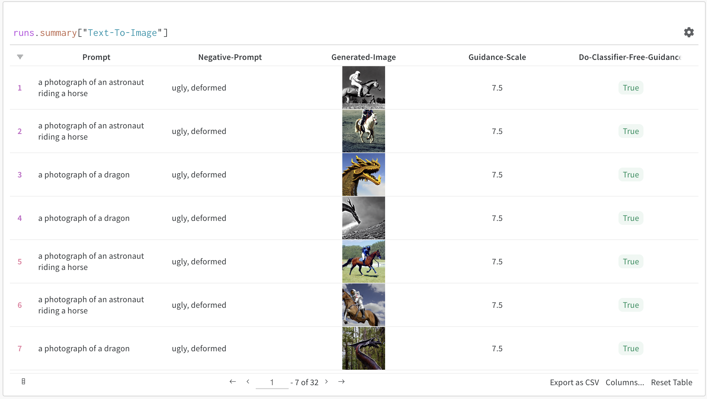
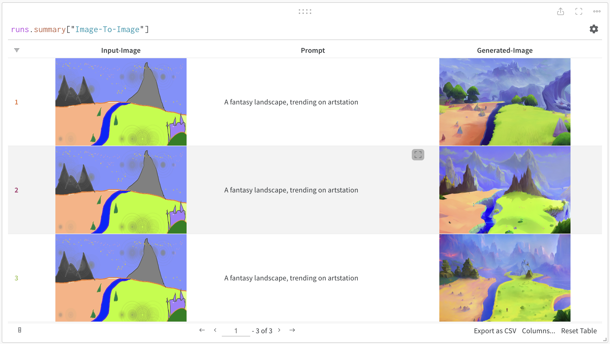
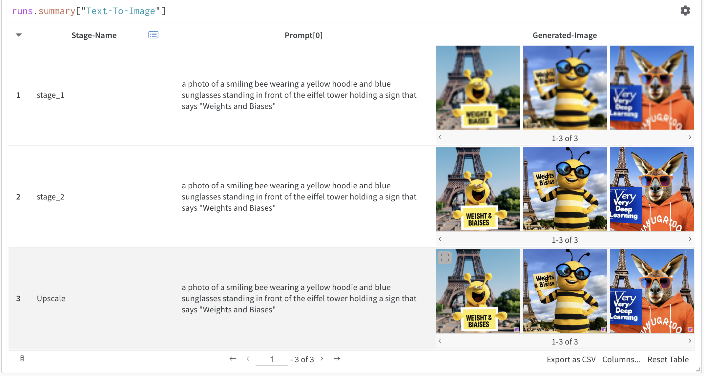

# Callbacks for 🧨 Diffusers pipelines

Callbacks for logging experiment details, configs and generated images for multi-modal diffusion pipelines from [Diffusers 🧨](https://huggingface.co/docs/diffusers) to your [Weights & Biases workspace](https://docs.wandb.ai/guides/app/pages/workspaces) or [Weave Dashboard](https://weave.wandb.ai/).

In order to install the depensencies to use the integration, you can run:

```shell
git clone https://github.com/soumik12345/wandb-addons
pip install ./wandb-addons[huggingface]
```

For detailed documentation, check out the following:

- [Auto-integrate](./auto_integrate.md)
- [DeepFloyd IF Callbacks](./deepfloyd_if.md)
- [Kandinsky Callback](./kandinsky.md)
- [Stable Diffusion Callbacks](./stable_diffusion.md)

| Text-to-Image on Weights & Biases |
| -------- |
|  |

| Image-to-Image on Weights & Biases |
| -------- |
|  |

| Multi-pipeline Text-to-Image Experiments using DeepFloydIF on Weights & Biases |
| -------- |
|  |
